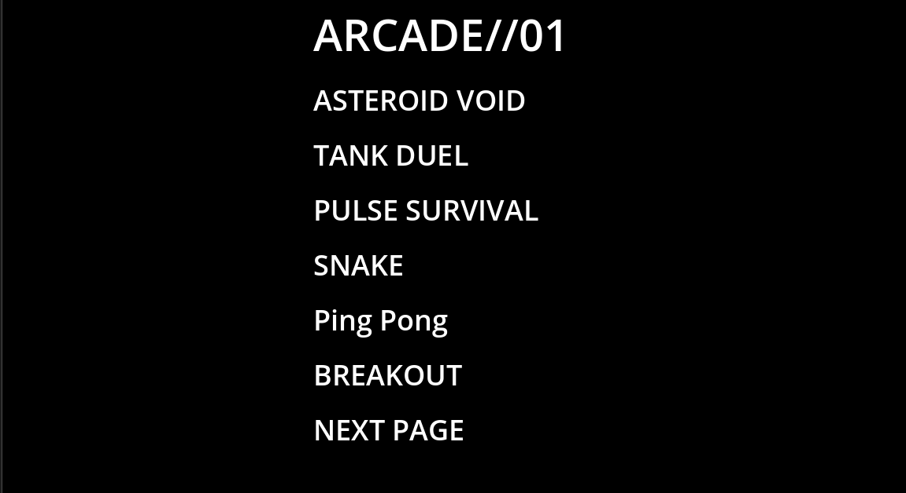
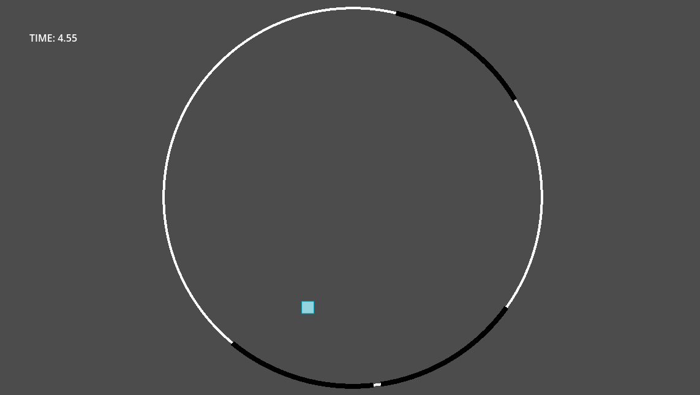

# ARCADE/01

ARCADE/01 is a retro arcade game collection created with the Godot Engine and GDScript. This project combines several classic arcade-style games into one application featuring a common launcher, consistent controls, and a simple black-and-white design.

The goal of ARCADE/01 is to bring back the feel of classic arcade machines while serving as a project focused on game development, artificial intelligence, collision systems, animation, scene management, and reusable game design.

Each game is designed as a separate scene but shares a common launcher, which allows the collection to grow without impacting existing games.

---

## Current Games

### Asteroid Void
Survive as long as possible by dodging falling asteroids while the game keeps getting harder.

**Controls**
- Left Arrow – Move Left
- Right Arrow – Move Right

---

### Tank Duel
Fight against an AI-controlled tank using movement, timing, and accurate shooting.

**Controls**
- A – Move Left
- D – Move Right
- Space – Fire

---

### Pulse Survival
Avoid expanding pulse waves by moving through randomly generated safe gaps.

**Controls**
- Arrow Keys – Move

---

### Snake
Classic Snake gameplay where eating food makes you longer while avoiding walls and yourself.

**Controls**
- Arrow Keys – Move

---

### Pong
Play single-player Pong against an AI opponent.

**Controls**
- Up Arrow – Move Up
- Down Arrow – Move Down

---

### Breakout
Break all the bricks while keeping the ball from dropping below the paddle.

**Controls**
- Left Arrow – Move Left
- Right Arrow – Move Right

---

### Flappy Square
Navigate through obstacles by timing each jump.

**Controls**
- Space
- Enter

---

### Frogger
Cross busy roads and rivers while avoiding cars and dangers.

**Status**
Under Development

---

### Space Invaders
Defeat waves of enemies while protecting yourself from their attacks.

**Status**
Under Development

---

### Dodge Arena
Survive in an arena by avoiding hazards that appear continuously.

**Status**
Under Development

---

### Tetris
Arrange falling blocks to complete horizontal lines and score points.

**Status**
Under Development

---

### Endless Runner
Run nonstop while dodging obstacles and aim for the highest score possible.

**Status**
Under Development

---

### Missile Command
Protect cities by intercepting incoming missiles before they hit the ground.

**Status**
Under Development

---

### Minesweeper
Classic puzzle game where players uncover safe tiles while steering clear of hidden mines.

**Status**
Under Development

---

### Pac-Man
A custom version of the classic maze game featuring a maze designed solely for ARCADE/01.

Current Features
- Custom maze
- Animated Pac-Man
- Wall collision
- Wrap tunnels

More gameplay features such as pellets, ghosts, scoring, AI, lives, and levels are being developed.

---

## Main Menu Controls

- Up Arrow – Navigate Up
- Down Arrow – Navigate Down
- Enter – Select
- Escape – Return or Quit

---

## Features

- Single arcade launcher
- Multiple standalone games
- Modular project structure
- Local high score support
- Keyboard controls
- Retro-styled minimalist graphics
- Built entirely using Godot Engine and GDScript
- Expandable design for future games

---

## Planned Features

- Save system
- Global settings
- Audio options
- Additional arcade titles
- Achievement system
- Better AI
- More visual effects
- Extra levels and gameplay modes

---

## Project Structure

Each game is implemented as a separate scene with its own scripts and assets. Shared systems like menus, UI components, and reusable objects are separated to keep the project organized and easy to maintain.

---

## Project Status

Current Version: Alpha

Games Available in Launcher: 14

Playable:
- Asteroid Void
- Tank Duel
- Pulse Survival
- Snake
- Pong
- Breakout
- Flappy Square

Currently in Development:
- Frogger
- Space Invaders
- Dodge Arena
- Tetris
- Endless Runner
- Missile Command
- Minesweeper
- Pac-Man

The collection will keep growing with more classic arcade games and original ideas.

## Apology
this whole project is made by me, so this project has bugs such as no highscore detection, collision bugs, i promise that this project will be clean in the next update and the pacman game is under construction right now, the next update will fix all the bugs and pacman game will be add to the game i request to consider all the other games which are working properly...
THANK YOU
sai charan..
## Images

